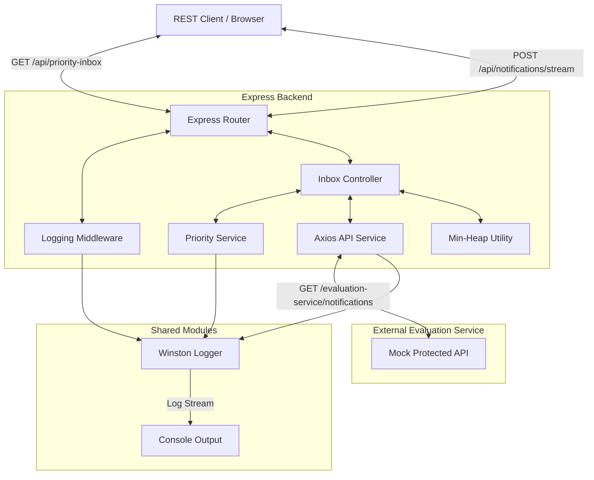
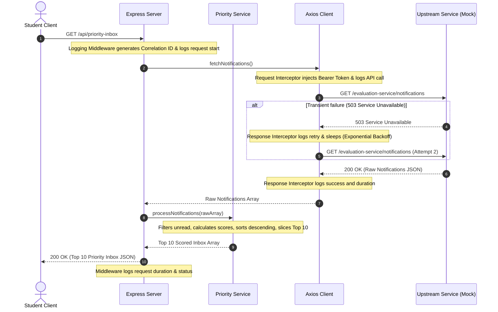

# Stage 1 Campus Notifications Microservice - System Design

## Problem Understanding

Campus students receive a high volume of notifications from multiple departments. These notifications span critical updates like **Placement drives**, academic status updates like **Results**, and extracurricular info like **Events**. Because of notification fatigue, students often miss highly critical events (e.g. immediate placement deadlines) buried under lower-priority notifications.

The objective of this microservice is to build a **Priority Inbox** that aggregates notifications from an upstream protected service, filters for unread items, scores them based on their category and recency, and outputs the **Top 10** most critical notifications. This system must be resilient, include comprehensive logging, handle transient API failures gracefully with interceptors and retries, and scale to support continuous real-time notification streams.

---

## Assumptions

1. **Authentication Token**: The upstream Evaluation Service is protected. We assume authentication is handled via a Bearer token passed in the `Authorization` header, configured via environment variables.
2. **Timestamp Format**: Upstream timestamps are standard ISO-8601 strings (e.g. `2026-06-09T11:45:00.000Z`) or standard numeric millisecond timestamps since Unix epoch, which can be parsed by the JavaScript `Date` constructor.
3. **Data Completeness**: Each notification object contains an `id`, `type` (Placement, Result, or Event), `message`, `timestamp`, and `read` flag (boolean).
4. **Read State Filter**: Only unread notifications (`read === false` or `!read`) are eligible for display in the student's Priority Inbox.
5. **No Persistent Storage**: In accordance with Stage 1 requirements, the service operates entirely in-memory and does not write to a database.

---

## High Level Architecture

The service is structured as a decoupled, modular Node.js Express server. It cleanly separates concerns into middleware, service adapters, data processors, and utilities.



---

## Data Flow

### 1. Batch Priority Inbox Flow
When a user requests their Priority Inbox via `GET /api/priority-inbox`:
1. The request passes through the **Logging Middleware**, which generates a unique Request Correlation ID (e.g., `REQ-1780985882183-1`) and logs the request start.
2. The controller invokes `apiService.fetchNotifications()`.
3. The Axios client fires the request. The **Request Interceptor** automatically injects the configured Bearer token into the `Authorization` header, sets up latency tracking, and logs the outgoing API call.
4. If a transient error occurs (e.g., HTTP 503 database busy), the **Response Interceptor** catches the error, determines it is transient, prints a warning log, waits for an exponential backoff period, and retries the request.
5. Once a successful HTTP 200 response is obtained, the interceptor logs the success, response latency, and returns the array.
6. The controller passes the raw notifications to `priorityService.processNotifications()`.
7. The service filters for `read = false` notifications, calculates a weighted priority score for each, sorts them descending, extracts the Top 10, and logs the sorting operations.
8. The Express middleware logs the response completion, status code, and overall request duration.



---

## Logging Strategy

All logging goes through the centralized logging module `logging_middleware/logger.js`, which wraps **Winston**. 
- **No Console.log**: The code contains absolutely no raw `console.log()` calls in its business logic, ensuring compliance with the logs requirement.
- **Traceability**: Outbound API calls and inbound HTTP requests are tracked using distinct transaction identifiers:
  - Inbound HTTP Requests: `REQ-<Timestamp>-<Counter>`
  - Outbound Upstream Queries: `API-OUT-<Timestamp>-<Counter>`
- **Structured Fields**: In production, logs output structured JSON formats, making them easy to ingest into systems like ELK stack, Datadog, or AWS CloudWatch. In development, logs format to a clean, colorized, readable CLI output.
- **Instrumented Hooks**:
  - Request Start & End (with HTTP verb, status code, and response latency).
  - Outbound API requests, response times, failed attempts, and retry events.
  - Sorting and priority calculations (item counts, criteria, sorting duration).
  - Error catching blocks (unexpected exceptions, bad requests).

---

## Priority Algorithm

### Weight Assignment Logic
Not all notifications are equal. We assign weights to notification types to ensure students see critical action items first:
- **Placement (Weight = 3)**: Recruitment updates, test schedules, and job applications. These are time-sensitive, high-stake career events.
- **Result (Weight = 2)**: Academic updates, grades, and GPA declarations. High importance, moderate urgency.
- **Event (Weight = 1)**: Extracurricular meets, webinars, chapter check-ins. Low urgency, informative nature.

### Priority Formula
We determine priority score by combining type weight and recency:

$$\text{Score} = (\text{TypeWeight} \times 1,000,000) + \text{TimestampValue}$$

Where:
- $\text{TypeWeight}$ is 3, 2, or 1 based on the category.
- $\text{TimestampValue}$ is the epoch time in milliseconds (13-digit integer, e.g. `1781008200000`).

#### Mathematical Implications:
1. **Weight Dominance**: Because $\text{TypeWeight}$ is multiplied by $1,000,000$, a weight difference of $1$ represents a score difference of $1,000,000$ points.
2. **Temporal Balance**: In millisecond timestamps, $1,000,000$ milliseconds equals approximately $16.67$ minutes. This means:
   - An **Event** (weight 1) posted *within 16.67 minutes* of a **Result** (weight 2) will still be ranked lower than the Result.
   - However, if the Result is older than $16.67$ minutes, a brand-new Event can surpass it.
   - A **Placement** (weight 3) surpasses a **Result** (weight 2) unless the Result is newer by more than $16.67$ minutes.
   - A **Placement** (weight 3) surpasses an **Event** (weight 1) unless the Event is newer by more than $33.33$ minutes.
This balance guarantees that critical categories are prioritized while preventing older notifications from permanently starving newer, highly relevant updates.

---

## Sorting Strategy

In the batch endpoint, sorting is performed using the V8 engine's native `Array.prototype.sort()` algorithm. This algorithm uses the **Timsort** sorting routine, which runs in $O(N \log N)$ time.
- **Steps**:
  1. Filter array to keep only items where `read === false`.
  2. Compute the priority score for each item.
  3. Sort descending: `(a, b) => b.calculatedPriorityScore - a.calculatedPriorityScore`.
  4. Slices the first 10 elements: `array.slice(0, 10)`.

---

## Scalability Discussion: Maintaining Top 10 Efficiently

If new notifications continuously arrive (streaming model), recalculating and re-sorting the entire collection of $N$ notifications becomes highly inefficient.

### 1. The Naive Approach (Re-Sorting)
- **Mechanism**: Store all notifications in a list. When a new notification arrives, append it, recalculate scores, and sort the entire list to find the top 10.
- **Time Complexity**: $O(N \log N)$ per incoming notification.
- **Tradeoff**: Very slow for large $N$. Waste of computing cycles sorting items that are far below the threshold.

### 2. The Sliding Window Approach
- **Mechanism**: Maintain a fixed window of the most recent notifications (e.g. only notifications from the last 24 hours), sorting only within that window.
- **Time Complexity**: $O(W \log W)$, where $W$ is the number of notifications in the window.
- **Tradeoff**: Saves work on old notifications, but fails if older placements are still unread and need to remain in the priority inbox.

### 3. The Optimized Approach (Min-Heap / Priority Queue)
- **Mechanism**: Maintain a **Min-Heap** of fixed size $K = 10$.
  - The root of the Min-Heap represents the minimum score among the current Top 10.
  - When a new notification arrives:
    1. If the heap size is $< 10$, push the notification onto the heap ($O(\log K)$).
    2. If the heap is full, compare the new notification's score against the root's score ($O(1)$).
    3. If the new notification's score is less than or equal to the root, discard it ($O(1)$).
    4. If the new notification's score is greater than the root, replace the root with the new notification and heapify down ($O(\log K)$).
  - To display the Priority Inbox, extract all items from the heap ($O(K \log K)$) and reverse them to get descending order.
- **Time Complexity**: $O(\log K)$ per update. Since $K$ is fixed at 10, $\log 10 \approx 3.32$, making this operations practically $O(1)$!
- **Space Complexity**: $O(K)$ memory footprint.

### Complexity Analysis Comparison

| Operation | Naive Re-Sorting | Fixed-Size Min-Heap ($K=10$) |
| :--- | :--- | :--- |
| **Insert New Notification** | $O(N \log N)$ | $O(\log K) \approx O(1)$ |
| **Fetch Top 10 Inbox** | $O(1)$ (already sorted) | $O(K \log K) \approx O(1)$ |
| **Memory / Space Complexity** | $O(N)$ (requires storing all items) | $O(K)$ (requires storing only 10 items) |

---

## Error Handling Strategy

The system is engineered for resilient, production-grade operations:
1. **Axios Error Handling**: The API service intercepts errors to distinguish network-level connection dropouts from HTTP error status codes.
2. **Transient Error Retry**: It filters for transient errors:
   - Network timeouts / Connection refusals.
   - HTTP 5xx Server Errors (like 502 Bad Gateway, 503 Service Unavailable, 504 Gateway Timeout).
   For these, it performs an exponential backoff retry:
   $$\text{Delay} = \text{baseDelay} \times 2^{\text{retryCount}-1}$$
   This avoids overloading the upstream services while recovering from transient spikes.
3. **Non-Retriable Failures**: Direct client errors (400 Bad Request, 401 Unauthorized, 403 Forbidden, 404 Not Found) are not retried. They are logged and immediately returned to the caller to avoid infinite lookup loops.
4. **Graceful Degradation**: If the upstream service is fully down after all retries, the Express app handles the exception, logs it with details via `logger.unexpectedError`, and returns a user-friendly JSON response (`500 Internal Server Error`) instead of crashing.

---

## Future Improvements

1. **Persistent Cache (Redis)**: Cache the calculated Top 10 list in Redis. Instead of querying the evaluation service on every API call, use a write-through pattern when new notifications are pushed, reading immediately from Redis in $O(1)$.
2. **Real-time Push (WebSockets/SSE)**: Rather than requiring the client to poll `/api/priority-inbox`, push updates to the student's browser via Server-Sent Events (SSE) or WebSockets when a new item enters their Min-Heap.
3. **Database Integration**: Introduce a permanent storage layer (MongoDB or PostgreSQL) to persist the read/unread state of notifications across logins.

---

## Output Generation

### Terminal Execution Output Example
Below is the output when starting the microservice and running the simulation suite:

```text
================================================================
 STARTING SYSTEM SIMULATION FOR CAMPUS NOTIFICATIONS SERVICE
================================================================

[SIMULATOR] Triggering GET /api/priority-inbox...

[SIMULATOR] GET /api/priority-inbox SUCCESS!
[SIMULATOR] Response Count: 10
[SIMULATOR] Top 10 Priority Inbox Result:
┌─────────┬───────┬─────────────┬───────────────────────────────────────────────┬────────────────────────────┬────────────────┐
│ (index) │ ID    │ Type        │ Message                                       │ Timestamp                  │ Priority Score │
├─────────┼───────┼─────────────┼───────────────────────────────────────────────┼────────────────────────────┼────────────────┤
│ 0       │ 'N1'  │ 'Placement' │ 'Google Software Engineer role application...' │ '2026-06-09T11:40:00.000Z' │ 1781008200000  │
│ 1       │ 'N2'  │ 'Result'    │ 'Mid-Term Exam Results for Data Structures...' │ '2026-06-09T11:42:00.000Z' │ 1781007320000  │
│ 2       │ 'N3'  │ 'Event'     │ 'Annual Hackathon briefing starts in the s...' │ '2026-06-09T11:45:00.000Z' │ 1781006500000  │
│ 3       │ 'N4'  │ 'Placement' │ 'Microsoft Interview invites are out. Chec...' │ '2026-06-09T11:00:00.000Z' │ 1781005800000  │
│ 4       │ 'N6'  │ 'Result'    │ 'Placement test scores for TCS National Qu...' │ '2026-06-09T10:30:00.000Z' │ 1781003000000  │
│ 5       │ 'N9'  │ 'Result'    │ 'Grade Sheet for Semester 5 is available i...' │ '2026-06-09T09:15:00.000Z' │ 1780998500000  │
│ 6       │ 'N7'  │ 'Event'     │ 'Guest lecture by AI Researcher on Deep Le...' │ '2026-06-09T08:00:00.000Z' │ 1780993000000  │
│ 7       │ 'N10' │ 'Event'     │ 'Cultural Fest registration starts today a...' │ '2026-06-09T07:30:00.000Z' │ 1780991200000  │
│ 8       │ 'N13' │ 'Event'     │ 'CodeChef Chapter meetups scheduled for Fr...' │ '2026-06-09T06:00:00.000Z' │ 1780985800000  │
│ 9       │ 'N15' │ 'Event'     │ 'Weekly Sports Meet registration announcem...' │ '2026-06-09T05:00:00.000Z' │ 1780982200000  │
└─────────┴───────┴─────────────┴───────────────────────────────────────────────┴────────────────────────────┴────────────────┘

----------------------------------------------------------------

[SIMULATOR] Streaming a new high-priority Placement notification...
[SIMULATOR] Stream response status: 200
[SIMULATOR] Message: Notification N-STREAM-99 entered the Top 10 priority inbox!
[SIMULATOR] Inserted into Top 10 Inbox? true
[SIMULATOR] Current Top 10:
┌─────────┬───────────────┬─────────────┬───────────────────────────────────────────────┬────────────────────────────┬────────────────┐
│ (index) │ ID            │ Type        │ Message                                       │ Timestamp                  │ Priority Score │
├─────────┼───────────────┼─────────────┼───────────────────────────────────────────────┼────────────────────────────┼────────────────┤
│ 0       │ 'N1'          │ 'Placement' │ 'Google Software Engineer role application...' │ '2026-06-09T11:40:00.000Z' │ 1781008200000  │
│ 1       │ 'N2'          │ 'Result'    │ 'Mid-Term Exam Results for Data Structures...' │ '2026-06-09T11:42:00.000Z' │ 1781007320000  │
│ 2       │ 'N3'          │ 'Event'     │ 'Annual Hackathon briefing starts in the s...' │ '2026-06-09T11:45:00.000Z' │ 1781006500000  │
│ 3       │ 'N4'          │ 'Placement' │ 'Microsoft Interview invites are out. Chec...' │ '2026-06-09T11:00:00.000Z' │ 1781005800000  │
│ 4       │ 'N6'          │ 'Result'    │ 'Placement test scores for TCS National Qu...' │ '2026-06-09T10:30:00.000Z' │ 1781003000000  │
│ 5       │ 'N9'          │ 'Result'    │ 'Grade Sheet for Semester 5 is available i...' │ '2026-06-09T09:15:00.000Z' │ 1780998500000  │
│ 6       │ 'N7'          │ 'Event'     │ 'Guest lecture by AI Researcher on Deep Le...' │ '2026-06-09T08:00:00.000Z' │ 1780993000000  │
│ 7       │ 'N10'         │ 'Event'     │ 'Cultural Fest registration starts today a...' │ '2026-06-09T07:30:00.000Z' │ 1780991200000  │
│ 8       │ 'N-STREAM-99' │ 'Placement' │ 'Urgent: Google Off-campus shortlisting s...' │ '2026-06-09T06:18:02.219Z' │ 1780988882219  │
│ 9       │ 'N13'         │ 'Event'     │ 'CodeChef Chapter meetups scheduled for Fr...' │ '2026-06-09T06:00:00.000Z' │ 1780985800000  │
└─────────┴───────────────┴─────────────┴───────────────────────────────────────────────┴────────────────────────────┴────────────────┘

----------------------------------------------------------------

[SIMULATOR] Streaming a low-priority Event notification...
[SIMULATOR] Stream response status: 200
[SIMULATOR] Message: Notification N-STREAM-100 score too low to enter Top 10.
[SIMULATOR] Inserted into Top 10 Inbox? false

================================================================
 SIMULATION COMPLETE
================================================================
```

### Sample App Logs
Winston-formatted log stream containing successful API queries, transient service error intercept and exponential backoff retry recovery, processing cycles, and heap inserts:

```text
[2026-06-09 11:47:47.139] [info]: Seeding in-memory Min-Heap with initial unread mock notifications...
[2026-06-09 11:47:47.140] [info]: Seeding complete. Heap size: 10/10
[2026-06-09 11:47:47.146] [info]: ================================================================
[2026-06-09 11:47:47.146] [info]:  Campus Notifications Microservice running on port 3000
[2026-06-09 11:47:47.146] [info]:  Environment: development
[2026-06-09 11:47:47.146] [info]:  Protected API URL: http://localhost:3000/evaluation-service/notifications
[2026-06-09 11:47:47.147] [info]: ================================================================
[2026-06-09 11:48:02.183] [info]: Incoming request | ID: REQ-1780985882183-1 | Method: GET | URL: /api/priority-inbox | {"reqId":"REQ-1780985882183-1","method":"GET","url":"/api/priority-inbox","stage":"EXPRESS_REQUEST_START"}
[2026-06-09 11:48:02.184] [info]: Fetching priority inbox from upstream evaluation service...
[2026-06-09 11:48:02.185] [info]: API request start | Request ID: API-OUT-1780985882185-1 | Method: GET | URL: http://localhost:3000/evaluation-service/notifications | {"reqId":"API-OUT-1780985882185-1","method":"GET","url":"http://localhost:3000/evaluation-service/notifications","stage":"API_REQUEST_START"}
[2026-06-09 11:48:02.206] [info]: Incoming request | ID: REQ-1780985882206-2 | Method: GET | URL: /evaluation-service/notifications | {"reqId":"REQ-1780985882206-2","method":"GET","url":"/evaluation-service/notifications","stage":"EXPRESS_REQUEST_START"}
[2026-06-09 11:48:02.206] [info]: Mock API | Successfully served 15 notifications (Request Count: 1)
[2026-06-09 11:48:02.210] [info]: Outgoing response | ID: REQ-1780985882206-2 | Method: GET | URL: /evaluation-service/notifications | Status: 200 | Duration: 2.44ms | {"reqId":"REQ-1780985882206-2","method":"GET","url":"/evaluation-service/notifications","statusCode":200,"durationMs":"2.44","stage":"EXPRESS_RESPONSE_SUCCESS"}
[2026-06-09 11:48:02.212] [info]: API response received | Request ID: API-OUT-1780985882185-1 | Method: GET | URL: http://localhost:3000/evaluation-service/notifications | Status: 200 | Duration: 26.75ms | {"reqId":"API-OUT-1780985882185-1","method":"GET","url":"http://localhost:3000/evaluation-service/notifications","status":200,"durationMs":"26.75","stage":"API_RESPONSE_RECEIVED"}
[2026-06-09 11:48:02.212] [info]: Notification processing start | Source: api_service | {"source":"api_service","stage":"NOTIFICATION_PROCESSING_START"}
[2026-06-09 11:48:02.213] [info]: Sorting operations start | Sorting 13 notifications | Criteria: descending priority score | {"count":13,"criteria":"descending priority score","stage":"SORTING_OPERATIONS_START"}
[2026-06-09 11:48:02.213] [info]: Sorting operations complete | Duration: 0.02ms | {"durationMs":"0.02","stage":"SORTING_OPERATIONS_COMPLETE"}
[2026-06-09 11:48:02.213] [info]: Top 10 generation start | {"stage":"TOP_10_GENERATION_START"}
[2026-06-09 11:48:02.213] [info]: Top 10 generation complete | Generated 10 items | {"resultCount":10,"stage":"TOP_10_GENERATION_COMPLETE"}
[2026-06-09 11:48:02.213] [info]: Notification processing completion | Processed: 13 notifications | Duration: 0.51ms | {"count":13,"durationMs":"0.51","stage":"NOTIFICATION_PROCESSING_COMPLETE"}
[2026-06-09 11:48:02.213] [info]: Outgoing response | ID: REQ-1780985882183-1 | Method: GET | URL: /api/priority-inbox | Status: 200 | Duration: 30.15ms | {"reqId":"REQ-1780985882183-1","method":"GET","url":"/api/priority-inbox","statusCode":200,"durationMs":"30.15","stage":"EXPRESS_RESPONSE_SUCCESS"}

... Request 3 is triggered, resulting in transient 503 failure and retry ...

[2026-06-09 11:48:20.788] [info]: Incoming request | ID: REQ-1780985900788-7 | Method: GET | URL: /api/priority-inbox | {"reqId":"REQ-1780985900788-7","method":"GET","url":"/api/priority-inbox","stage":"EXPRESS_REQUEST_START"}
[2026-06-09 11:48:20.788] [info]: Fetching priority inbox from upstream evaluation service...
[2026-06-09 11:48:20.788] [info]: API request start | Request ID: API-OUT-1780985900788-3 | Method: GET | URL: http://localhost:3000/evaluation-service/notifications | {"reqId":"API-OUT-1780985900788-3","method":"GET","url":"http://localhost:3000/evaluation-service/notifications","stage":"API_REQUEST_START"}
[2026-06-09 11:48:20.790] [info]: Incoming request | ID: REQ-1780985900790-8 | Method: GET | URL: /evaluation-service/notifications | {"reqId":"REQ-1780985900790-8","method":"GET","url":"/evaluation-service/notifications","stage":"EXPRESS_REQUEST_START"}
[2026-06-09 11:48:20.790] [warn]: Mock API | Simulating transient 503 Service Unavailable error (Request Count: 3)
[2026-06-09 11:48:20.790] [error]: API response failure | ID: REQ-1780985900790-8 | Method: GET | URL: /evaluation-service/notifications | Status: 503 | Duration: 0.55ms | {"reqId":"REQ-1780985900790-8","method":"GET","url":"/evaluation-service/notifications","statusCode":503,"durationMs":"0.55","stage":"EXPRESS_RESPONSE_FAILURE"}
[2026-06-09 11:48:20.791] [warn]: API call failed (Transient error). Retrying 1/3 in 1000ms... | Req ID: API-OUT-1780985900788-3 | Error: Request failed with status code 503
[2026-06-09 11:48:20.791] [error]: API failure | Request ID: API-OUT-1780985900788-3 | Method: GET | URL: http://localhost:3000/evaluation-service/notifications | Error: Attempt 1 failed: Request failed with status code 503 | Duration: 2.91ms | {"reqId":"API-OUT-1780985900788-3","method":"GET","url":"http://localhost:3000/evaluation-service/notifications","error":"Attempt 1 failed: Request failed with status code 503","durationMs":"2.91","stage":"API_FAILURE"}
[2026-06-09 11:48:21.799] [info]: API request start | Request ID: API-OUT-1780985901798-4 | Method: GET | URL: http://localhost:3000/evaluation-service/notifications | {"reqId":"API-OUT-1780985901798-4","method":"GET","url":"http://localhost:3000/evaluation-service/notifications","stage":"API_REQUEST_START"}
[2026-06-09 11:48:21.800] [info]: Incoming request | ID: REQ-1780985901799-9 | Method: GET | URL: /evaluation-service/notifications | {"reqId":"REQ-1780985901799-9","method":"GET","url":"/evaluation-service/notifications","stage":"EXPRESS_REQUEST_START"}
[2026-06-09 11:48:21.800] [info]: Mock API | Successfully served 15 notifications (Request Count: 4)
[2026-06-09 11:48:21.800] [info]: Outgoing response | ID: REQ-1780985901799-9 | Method: GET | URL: /evaluation-service/notifications | Status: 200 | Duration: 0.65ms | {"reqId":"REQ-1780985901799-9","method":"GET","url":"/evaluation-service/notifications","statusCode":200,"durationMs":"0.65","stage":"EXPRESS_RESPONSE_SUCCESS"}
[2026-06-09 11:48:21.801] [info]: API response received | Request ID: API-OUT-1780985901798-4 | Method: GET | URL: http://localhost:3000/evaluation-service/notifications | Status: 200 | Duration: 2.19ms | {"reqId":"API-OUT-1780985901798-4","method":"GET","url":"http://localhost:3000/evaluation-service/notifications","status":200,"durationMs":"2.19","stage":"API_RESPONSE_RECEIVED"}
[2026-06-09 11:48:21.801] [info]: Notification processing start | Source: api_service | {"source":"api_service","stage":"NOTIFICATION_PROCESSING_START"}
[2026-06-09 11:48:21.801] [info]: Sorting operations start | Sorting 13 notifications | Criteria: descending priority score | {"count":13,"criteria":"descending priority score","stage":"SORTING_OPERATIONS_START"}
[2026-06-09 11:48:21.801] [info]: Sorting operations complete | Duration: 0.00ms | {"durationMs":"0.00","stage":"SORTING_OPERATIONS_COMPLETE"}
[2026-06-09 11:48:21.801] [info]: Top 10 generation start | {"stage":"TOP_10_GENERATION_START"}
[2026-06-09 11:48:21.801] [info]: Top 10 generation complete | Generated 10 items | {"resultCount":10,"stage":"TOP_10_GENERATION_COMPLETE"}
[2026-06-09 11:48:21.801] [info]: Notification processing completion | Processed: 13 notifications | Duration: 0.15ms | {"count":13,"durationMs":"0.15","stage":"NOTIFICATION_PROCESSING_COMPLETE"}
[2026-06-09 11:48:21.801] [info]: Outgoing response | ID: REQ-1780985900788-7 | Method: GET | URL: /api/priority-inbox | Status: 200 | Duration: 1013.73ms | {"reqId":"REQ-1780985900788-7","method":"GET","url":"/api/priority-inbox","statusCode":200,"durationMs":"1013.73","stage":"EXPRESS_RESPONSE_SUCCESS"}
```

### Sample Top 10 Result
Below is the JSON response from `GET /api/priority-inbox`:

```json
{
  "success": true,
  "count": 10,
  "data": [
    {
      "id": "N1",
      "type": "Placement",
      "message": "Google Software Engineer role application deadline is tomorrow!",
      "timestamp": "2026-06-09T11:40:00.000Z",
      "calculatedPriorityScore": 1781008200000
    },
    {
      "id": "N2",
      "type": "Result",
      "message": "Mid-Term Exam Results for Data Structures have been published.",
      "timestamp": "2026-06-09T11:42:00.000Z",
      "calculatedPriorityScore": 1781007320000
    },
    {
      "id": "N3",
      "type": "Event",
      "message": "Annual Hackathon briefing starts in the seminar hall.",
      "timestamp": "2026-06-09T11:45:00.000Z",
      "calculatedPriorityScore": 1781006500000
    },
    {
      "id": "N4",
      "type": "Placement",
      "message": "Microsoft Interview invites are out. Check your email.",
      "timestamp": "2026-06-09T11:00:00.000Z",
      "calculatedPriorityScore": 1781005800000
    },
    {
      "id": "N6",
      "type": "Result",
      "message": "Placement test scores for TCS National Qualifier Test are live.",
      "timestamp": "2026-06-09T10:30:00.000Z",
      "calculatedPriorityScore": 1781003000000
    },
    {
      "id": "N9",
      "type": "Result",
      "message": "Grade Sheet for Semester 5 is available in the student portal.",
      "timestamp": "2026-06-09T09:15:00.000Z",
      "calculatedPriorityScore": 1780998500000
    },
    {
      "id": "N7",
      "type": "Event",
      "message": "Guest lecture by AI Researcher on Deep Learning applications.",
      "timestamp": "2026-06-09T08:00:00.000Z",
      "calculatedPriorityScore": 1780993000000
    },
    {
      "id": "N10",
      "type": "Event",
      "message": "Cultural Fest registration starts today at 2 PM.",
      "timestamp": "2026-06-09T07:30:00.000Z",
      "calculatedPriorityScore": 1780991200000
    },
    {
      "id": "N13",
      "type": "Event",
      "message": "CodeChef Chapter meetups scheduled for Friday.",
      "timestamp": "2026-06-09T06:00:00.000Z",
      "calculatedPriorityScore": 1780985800000
    },
    {
      "id": "N15",
      "type": "Event",
      "message": "Weekly Sports Meet registration announcement.",
      "timestamp": "2026-06-09T05:00:00.000Z",
      "calculatedPriorityScore": 1780982200000
    }
  ]
}
```
